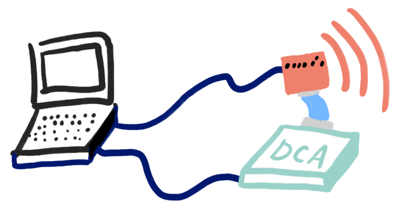
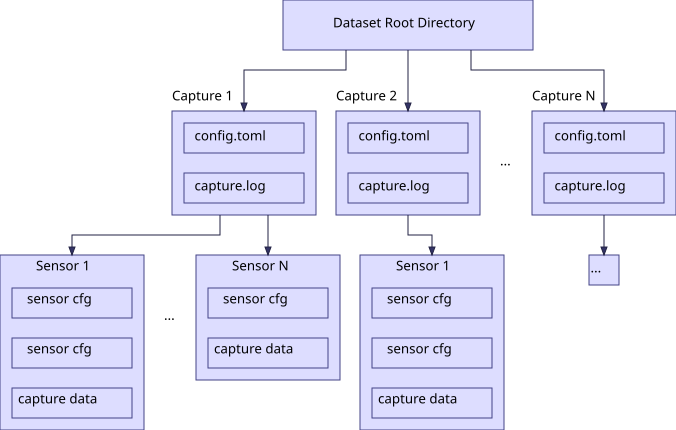
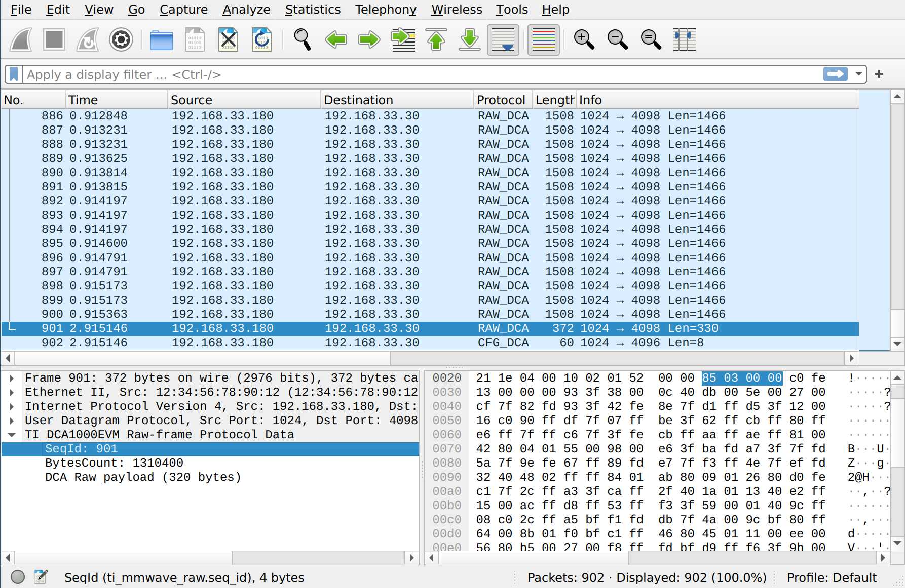
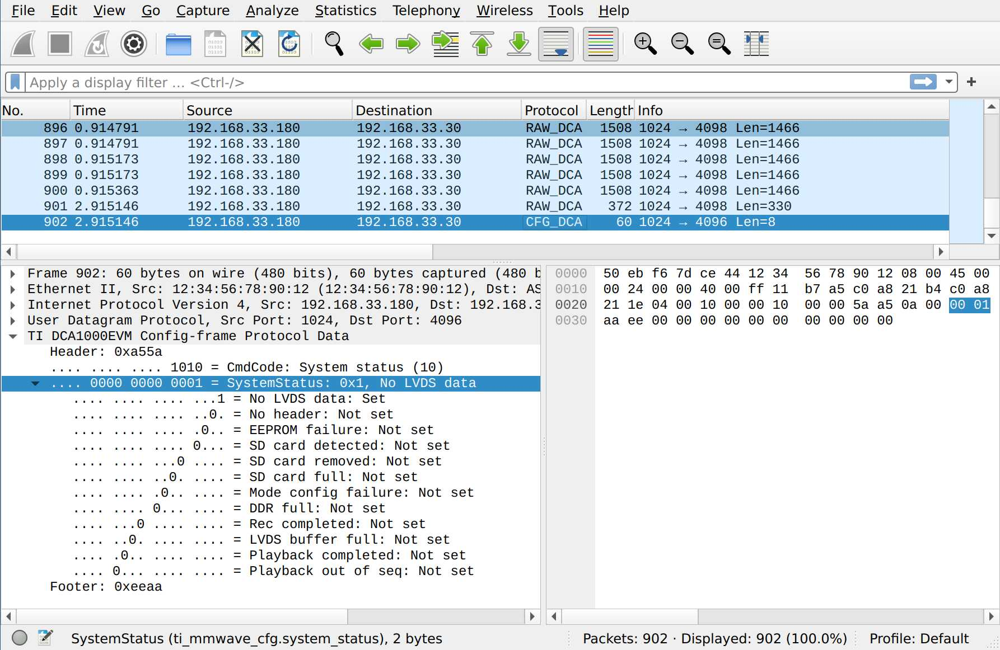

Quickstart
==========



``mmwave-capture-std`` consists of 3 modules: mmwave hardware interface (:class:`~mmwavecapture.radar.Radar`, :class:`~mmwavecapture.dca1000.DCA1000`), data capture and hardware managing (:class:`~mmwavecapture.capture.capture`), and raw data parser (:class:`~mmwavecapture.parser`).

In the following quickstart, all commands and live capture processes run on a
Raspberry Pi 4. The Pi receives raw data from TI IWR1843BOOST and DCA1000EVM;
the operator computer only controls the Pi over Wi-Fi/SSH.


Prerequisites
-------------

Before we start the quickstart, please make sure you setup the hardware and software environment properly.

Please refer to :doc:`Setup page <setup>` for more details.

For the following quickstart, we assume you have the following hardware setup:

- Raspberry Pi 4 running 64-bit Raspberry Pi OS
- IWR1843BOOST (Out-of-box demo SDK: 3.6.0)
- DCA1000EVM (FPGA firmware: 2.8)
- ADXL355 connected to Pi SPI0 CE0 with DRDY on GPIO25

The IWR1843BOOST USB and DCA1000EVM Ethernet cables both terminate at the Pi.
IWR1843BOOST and DCA1000EVM are also joined by their 60-pin HD connector. See
:doc:`Setup page <setup>` for the complete topology.

Millimeter-wave Hardware Interface
----------------------------------

In ``mmwave-capture-std``, :class:`~mmwavecapture.radar.Radar` and :class:`~mmwavecapture.dca1000.DCA1000` only focus on hardware setup, that means the actual data capturing is not done in the millimeter-wave hardware interface.

Communicate with Radar
``````````````````````

First connect the IWR1843BOOST XDS110 USB cable directly to the Raspberry Pi
and identify both UART paths on the Pi. Raspberry Pi OS normally exposes them
as ``/dev/ttyACM0`` and ``/dev/ttyACM1`` respectively.

.. note:: Having trouble to find UART path? See reference: MMWAVE SDK User Guide

A minimum code to communicate with radar will be like this:

.. code-block:: python

    import mmwavecapture.radar

    cfg_file = "tests/configs/xwr18xx_profile_2023_01_01T00_00_00_000.cfg"
    radar = mmwavecapture.radar.Radar(
        config_port="/dev/ttyACM0",
        config_baudrate=115200,
        data_port="/dev/ttyACM1",
        data_baudrate=921600,
        config_filename=cfg_file,
        initialize_connection_and_radar=True,
        capture_frames=100,
    )

    print(radar.get_radar_status())

It should connect to radar UARTs, initialize the radar,
and print out the radar status and data port baudrate:

.. code-block:: bash

    (<RadarStatus.INIT: 0>, 921600)

We can then config the radar as what we provided in ``cfg_file`` and
``capture_frames``:

.. code-block:: python

    radar.config()

If it runs without any error, great! That means we config the radar
correctly and it is ready to start sensing.

Then we can start sensing by calling :meth:`~mmwavecapture.Radar.start_sensor()`

.. code-block:: python

    radar.start_sensor()


Vola, the radar start to sensing!

.. note::

   This module DOES NOT caputre data from radar DSP
   (from :attr:`~mmwavecapture.Radar._data_port`).

Communicate with DCA1000EVM
```````````````````````````

Connect the DCA1000EVM Ethernet port directly to the Raspberry Pi wired
interface. The example uses Pi interface ``eth0`` with address
``192.168.33.30/24`` and DCA1000EVM address ``192.168.33.180``.

A minimum code to communicate with DCA1000EVM data capture card will be like this:

.. code-block:: python

    import mmwavecapture.dca1000

    dca = mmwavecapture.dca1000.DCA1000()
    print(dca.read_fpga_version())

It should print out the FPGA version of DCA1000EVM data capture card,
it shows our DCA1000EVM FPGA firmware version is 2.8, and it is not in
playback mode:

.. code-block:: bash

    (2, 8, False)

We can then config the DCA1000EVM data capture card:

.. code-block:: python

    dca.system_connection()
    dca.reset_fpga()
    dca.config_fpga()
    dca.config_packet_delay()
    dca.start_record()

Great, now the data capture card is start to capture data from the radar.

.. note::

    After :meth:`~mmwavecapture.dca1000.DCA1000.start_record()` is called,
    the data capture card will start to capture data from radar. But if
    they did not receive any data from radar after 10 seconds, it will
    throw out an ``No LVDS data`` error status and stop capturing data.

    You can observe this by taking a look at the DCA1000EVM data capture
    card status LED, you will see the ``LVDS_PATH_ERR_LED3`` is on (red light).


Synchronized radar and ADXL355 capture
--------------------------------------

The combined capture runs entirely on the Pi and places radar, ADXL355, and
synchronization evidence under one hardware directory. Before running it,
build the two Linux GPIO uAPI v2 native helpers:

.. code-block:: bash

   make -C native/adxl355_capture
   make -C native/adxl355_capture print-hw
   make -C native/frame_trigger

``print-hw`` must report ``ADXL355 Linux hardware support: 1``. The ADXL355
example uses ``/dev/spidev0.0`` and GPIO25 (physical pin 22) for DRDY. See
:doc:`Setup <setup>` for the complete 3.3 V, GND, MOSI, MISO, SCLK, CE0, and
DRDY pin table.

Choose one mode:

- ``software_timestamp`` uses
  ``examples/capture_synchronized_software.toml`` and radar
  ``frameCfg triggerSelect=1``. It needs no radar GPIO wire. The coordinator
  records the Pi monotonic-time bracket around ``sensorStart`` and constructs
  frame references from its midpoint plus the decoded radar algorithm
  manifest's nominal period. It never falls back to configured frame count.
- ``hardware_trigger`` uses
  ``examples/capture_synchronized_hardware.toml`` and
  ``frameCfg triggerSelect=2``. Connect GPIO18 (physical pin 12) to
  IWR1843BOOST J6-9 ``SYNC_IN`` and Pi GND to J6-4. This normal two-wire
  configuration uses ``use_loopback = false`` and is sufficient for the
  operational ``algorithm_ready`` gate. For optional kernel edge diagnostics,
  branch the GPIO18 net to GPIO24 (physical pin 18), then set
  ``use_loopback = true`` and ``loopback_line = 24``.

Hardware trigger count must equal ``capture_frames``. Its frequency is capped
at 90% of the configured radar frame rate and defaults to that value when
omitted. Both ``initial_delay_ms`` and the inter-trigger period must stay below
5 seconds as a conservative guard against DCA1000's roughly 10-second no-LVDS
timeout.
The edge is a Pi-side radar trigger
reference, not a measured ADC sampling instant. It does not frequency-lock the
ADXL355 and radar ADC clocks.

Normal exit and SIGTERM only make a best-effort attempt to return GPIO18 low;
SIGKILL cannot run cleanup. Use a hardware pull-down on the assembled trigger
net and confirm idle and pulse levels with a scope or logic analyzer.

Run the read-only software-mode preflight first:

.. code-block:: bash

   uv run mmwavecapture-preflight \
     --interface eth0 \
     --host-ip 192.168.33.30 \
     --config-serial /dev/ttyACM0 \
     --data-serial /dev/ttyACM1 \
     --spi-device /dev/spidev0.0 \
     --gpiochip /dev/gpiochip0 \
     --adxl-binary native/adxl355_capture/build/adxl355_capture \
     --sync-mode software_timestamp

Then record the short software fixture locally on the Pi:

.. code-block:: bash

   uv run mmwavecapture-std examples/capture_synchronized_software.toml

For hardware mode, change the preflight mode and add the trigger binary:

.. code-block:: bash

   uv run mmwavecapture-preflight \
     --interface eth0 \
     --host-ip 192.168.33.30 \
     --config-serial /dev/ttyACM0 \
     --data-serial /dev/ttyACM1 \
     --spi-device /dev/spidev0.0 \
     --gpiochip /dev/gpiochip0 \
     --adxl-binary native/adxl355_capture/build/adxl355_capture \
     --sync-mode hardware_trigger \
     --trigger-binary native/frame_trigger/frame_trigger

Only after the additional power-off wiring and firmware checks, run:

.. code-block:: bash

   uv run mmwavecapture-std examples/capture_synchronized_hardware.toml

Keep ``hardware_validated = false`` until the actual J6 routing, firmware
response, waveform, frame correspondence, and latency have been measured. A
passing preflight or mock test is not that measurement.

The successful output is:

.. code-block:: text

   example_synchronized_dataset/capture_00000/
   |-- capture.log
   |-- config.toml
   |-- status.json
   `-- synchronized/
       |-- radar/
       |   |-- dca.pcap
       |   |-- radar.cfg
       |   |-- dca.json
       |   `-- algorithm_input/...
       |-- adxl355/
       |   |-- samples.bin
       |   |-- summary.json
       |   |-- ready.json
       |   |-- config.json
       |   `-- algorithm_input/...
       `-- sync/
           |-- config.json
           |-- manifest.json
           |-- timeline.json
           |-- radar_frame_monotonic_ns.npy
           |-- frame_trigger_events.csv       # hardware mode only
           `-- frame_trigger_summary.json     # hardware mode only

Use the validated readers at the algorithm boundary:

.. code-block:: python

   from mmwavecapture import (
       load_adxl355_input,
       load_algorithm_input,
       load_synchronized_timeline,
   )

   run = "example_synchronized_dataset/capture_00000/synchronized"
   radar = load_algorithm_input(f"{run}/radar")
   adxl = load_adxl355_input(f"{run}/adxl355")
   timeline = load_synchronized_timeline(run)

   print(radar.adc_cube.shape)
   print(adxl.acceleration_mps2.shape)
   print(timeline.radar_frame_monotonic_ns)
   print(timeline.manifest["provenance"])
   print(timeline.combined_manifest["status"])

In software mode, the synchronized timeline is the ``sensorStart`` bracket
midpoint plus the decoded radar manifest's nominal frame period. In hardware
mode it uses GPIO24 kernel loopback edges when enabled, otherwise GPIO18
userspace output-set completion times; the latter is not an observed physical
edge. Both are explicitly reference times rather than radar ADC sample times.
DCA1000 PCAP timestamps remain Ethernet packet receive times.

Timeline publication requires the real decoded radar algorithm manifest with
complete packet integrity. The loader also requires the sibling combined sync
manifest and any capture-root ``status.json`` to be complete, then cross-checks
mode, quality, validation flag, array metadata, period, provenance, and decoded
radar dimensions. Disabled optional exports are omitted from the combined file
map.

At the default 1 kHz ODR, ADXL355 fails closed on any DRDY sequence gap,
multi-event GPIO backlog, FIFO overrun/protocol error, non-one-set pre-pop
depth, or nonzero post-pop depth. Partial records remain diagnostic evidence,
but a complete ADXL algorithm-input manifest is not published. The stored
digital-filter group delay is currently uncalibrated; zero does not mean zero
physical latency. The coordinator supervises the ADXL process throughout the
combined run and fails the package if it exits early.

For a completed hardware-trigger capture, check the default operational gate
and run the standalone algorithm from the repository root:

.. code-block:: bash

   run=example_synchronized_dataset/capture_00000/synchronized
   uv run mmwavecapture-fusion-check "$run"
   PYTHONPATH=capture_program/src \
     python3 -m algorithm.run \
     --input "$run" --output /tmp/algorithm_result.npz

The runner keeps the radar and ADXL355 native timelines separate and
preintegrates acceleration over each actual radar interval. It writes
``algorithm_result.npz`` plus a JSON provenance summary. Add
``--adxl-sign -1`` when the selected sensor axis points opposite to positive
structural displacement. Add
``--require-calibrated`` only when the strict ``fusion_ready`` gate is needed.


Radar-only CaptureManager example
---------------------------------

The older radar-only example remains available when ADXL355 synchronization is
not required.

Unlike other packages, ``mmwave-capture-std`` separate the data capturing from the
millimeter-wave hardware interface, so we have a separate module for data capturing.

Let us see how we can capture data easily with ``mmwave-capture-std`` by
our high-level :class:`~mmwavecapture.capture.CaptureManager`:


.. code-block:: python

   import mmwavecapture.capture

   cm_config_file = "examples/capture_iwr1843.toml"
   cm = mmwavecapture.capture.CaptureManager(cm_config_file)
   cm.init_hw()
   cm.capture()

That's all! Then it should start to capture data from radar and DCA1000EVM data capture card,
with the configuration provided in ``cm_config_file``.

.. code-block:: bash

    ☁  mmwave-capture-std [add-docs] ⚡  uv run python
    Python 3.10.10 (main, Mar  5 2023, 22:26:53) [GCC 12.2.1 20230201] on linux
    Type "help", "copyright", "credits" or "license" for more information.
    >>> import mmwavecapture.capture
    >>>
    >>> cm_config_file = "examples/capture_iwr1843.toml"
    >>> cm = mmwavecapture.capture.CaptureManager(cm_config_file)
    2023-06-03 13:07:32.093 | INFO     | mmwavecapture.capture.capture:_get_next_capture_dir:276 - Capture ID: 1
    >>> cm.init_hw()
    2023-06-03 13:07:32.098 | INFO     | mmwavecapture.capture.capture:init_hw:281 - Initializing capture hardware `iwr1843` from `mmwavecapture.capture.RadarDCA`
    2023-06-03 13:07:37.504 | SUCCESS  | mmwavecapture.capture.capture:init_hw:296 - Capture hardware `iwr1843` initialized
    2023-06-03 13:07:37.505 | SUCCESS  | mmwavecapture.capture.capture:init_hw:298 - Total of 1 capture hardware initialized
    >>> cm.capture()
    2023-06-03 13:07:44.278 | INFO     | mmwavecapture.capture.capture:capture:309 - Adding capture hardware `iwr1843`
    2023-06-03 13:07:44.278 | INFO     | mmwavecapture.capture.capture:capture:174 - Preparing capture hardware
    2023-06-03 13:07:44.287 | INFO     | mmwavecapture.capture.capture:capture:178 - Starting capture hardware
    2023-06-03 13:07:44.383 | SUCCESS  | mmwavecapture.capture.capture:capture:181 - Capture started
    2023-06-03 13:07:47.457 | INFO     | mmwavecapture.capture.capture:capture:185 - Capture finished
    2023-06-03 13:07:47.457 | INFO     | mmwavecapture.capture.capture:capture:187 - Dumping capture hardware configurations
    2023-06-03 13:07:47.458 | SUCCESS  | mmwavecapture.capture.capture:capture:321 - Capture finished, all files output to `example_dataset/capture_00001/`
    >>>

Yep, capturing data is that easy with ``mmwave-capture-std``.

:class:`~mmwavecapture.capture.CaptureManager` Dataset Directories Structure in ``mmwave-capture-std``
``````````````````````````````````````````````````````````````````````````````````````````````````````

``mmwave-capture-std`` aims at providing a HDF5-like dataset structure for the captured data,
so that it is easy to use and easy to manage for everyone.

The dataset directories structure is like this:



   Dataset directories structure

.. code-block:: bash

    dataset_path/           # Create when initalizing `CaptureManager`
    ├── capture_00000/      # Create when calling `CaptureManager.capture()`
    │   ├── config.toml     # Capture configuration
    │   ├── capture.log     # Capture log
    │   ├── iwr1843_vert/   # Capture hardware name
    │   │   ├── algorithm_input/
    │   │   │   ├── adc_cube.npy
    │   │   │   ├── chirp_cube.npy
    │   │   │   ├── frame_times_s.npy
    │   │   │   ├── manifest.json
    │   │   ├── dca.pcap    # DCA1000EVM capture pcap
    │   │   ├── radar.cfg   # Radar configuration
    │   │   ├── dca.json    # DCA1000EVM configuration
    │   ├── realsense/      # Another capture hardware name
    │   │   ├── color.avi   # Color video
    ├── capture_00001/
    │   ├── config.toml
    │   ├── capture.log
    │   ├── iwr1843_vert/
    │   │   ├── dca.pcap
    ...

At each capture directory, there is a ``config.toml`` file, which contains the
capture configuration, a ``capture.log`` includes logging, and a directory for each capture hardware, which contains the hardware configuration and its captured data.


Replicate the capture of a specific dataset capture
```````````````````````````````````````````````````

If you want to replicate the capture of a specific dataset capture, you just
need to run the capture manager with the ``config.toml`` file of that capture.
Easy and simple!

.. note::

   Connect all capture hardware to the Raspberry Pi and modify ``config.toml``
   to match the Pi's UART paths and dedicated DCA Ethernet interface. The
   operator computer remains outside the live capture path.


Using Captured Radar Data in an Algorithm
-----------------------------------------

In the example configuration, the captured result will be stored in
``example_dataset/capture_00000/``. The layout should be like this:

.. code-block:: bash

    example_dataset/capture_00000/
    ├── config.toml
    ├── capture.log
    ├── iwr1843/
    │   ├── algorithm_input/
    │   │   ├── adc_cube.npy
    │   │   ├── chirp_cube.npy
    │   │   ├── frame_times_s.npy
    │   │   ├── manifest.json
    │   ├── dca.pcap
    │   ├── radar.cfg
    │   ├── dca.json

The acquisition program, rather than each downstream algorithm, owns the
DCA1000 and radar-specific adaptation. It checks packet and byte-counter
continuity, decodes the two LVDS lanes and I/Q order, and reshapes samples using
``radar.cfg`` before publishing ``manifest.json``.

Load the versioned, stable output through the reader:

.. code-block:: python

    from mmwavecapture import load_algorithm_input

    capture = load_algorithm_input(
        "example_dataset/capture_00000/iwr1843"
    )
    print(capture.adc_cube.shape)
    print(capture.adc_cube.dtype)
    print(capture.frame_times_s)

``adc_cube`` is ``complex64`` with axes
``(frame, virtual_antenna, adc_sample)`` and is ready for the frame-level
algorithm frontend. ``chirp_cube`` retains the lossless standardized axes
``(frame, chirp_loop, virtual_antenna, adc_sample)``. Exact axes, TX/RX channel
mapping, timing, aggregation, and integrity results are recorded in
``manifest.json``.

An older capture containing only ``dca.pcap`` and ``radar.cfg`` can be exported
once at the acquisition boundary:

.. code-block:: bash

    uv run mmwavecapture-export example_dataset/capture_00000/iwr1843

Debugging the pcap file by Wireshark
------------------------------------

The benefit of using ``tcpdump`` to capture the raw millimeter-wave signal
is that we ensure all the packets are captured, resolve out-of-order packets, having additional information for each packet, and we can use
Wireshark to debug the pcap file.

``mmwave-capture-std`` provides a Wireshark dissector for the DCA1000EVM
raw packet and config packet. You can find the dissector in
``wireshark/dca1000evm_raw.lua``.

To use the dissector, simply type in the following command in your terminal:

.. code-block:: bash

    wireshark -X lua_script:wireshark/dca1000evm_raw.lua \
              example_dataset/capture_00000/iwr1843/dca.pcap

Then you can see the packets in Wireshark:


          sequence ID for this packet is 901, and the
          total bytes (without that packet) sent by the
          data capture card is 1310400 bytes.

    The DCA1000EVM raw packet dissector


          system status packet with No LVDS data flag set.

    The DCA1000EVM config packet dissector


What's Next?
------------

Now you have learned the basic of ``mmwave-capture-std``!

.. Do you want to add your own hardware support? See :ref:`Adding new hardware support <adding_new_hardware_support>`.
