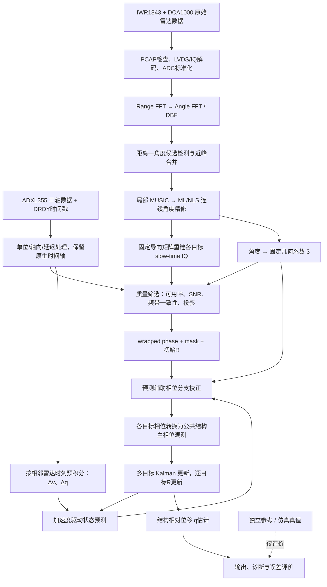

# 本论文的完整数据处理流程

核对日期：2026-09-14。依据当前工作区代码与最新 Direct-AoA 架构整理。本次只梳理流程，未修改算法、重新运行实验或采集硬件数据。

当前主线为：**双传感器采集与标准化 → 原生时间轴处理 → 距离—角度候选检测 → 直接 AoA 精估计与目标 IQ 重建 → 质量筛选 → 固定几何系数 β → 加速度辅助相位分支校正 → 多目标结构主相位 Kalman → 相对位移与独立评价。**

论文正文仍保留独立 β 预校准的旧描述；当前默认代码已经采用 `direct_aoa_fixed_beta`。旧独立预校准及更早的在线 β 反馈均属于显式历史/消融分支。

## 1. 测量对象和两种相位

雷达与 MEMS 加速度计共址安装在结构测点，随结构一起运动。雷达观测相对静止的环境散射体，估计结构沿指定主振动方向的相对位移。

- **阵元之间的空间相位差**用于估计散射体方向，即 AoA。
- **同一散射体随时间的相位变化**用于测量沿视线方向的位移，即 LoS 位移。
- 多个散射体对应同一结构运动的不同方向投影，后端估计一个公共结构状态。

现有一维模型为：

\[
\Theta_k=\frac{4\pi}{\lambda}q_k,\qquad
\phi_{i,k}^{\mathrm{LOS}}=\frac{\Theta_k}{\beta_i}+b_i.
\]

其中，\(q\) 为结构主方向相对位移，\(\Theta\) 为对应主相位，\(b_i\) 为目标固定相位偏置。当前代码使用 \(\beta_i=1/|\cos\theta_i|\)；应用这一映射需要安装姿态、结构方向和角度定义与一维模型一致。实机不能未经轴向核对就把任意方位角直接解释为结构位移投影角。

## 2. 总体流程



该图概括当前离线处理链。Kalman 部分逐帧递推，但目标选择、角度拟合及默认 Q 选择会使用记录中的多个时刻，不能把整条现有实现表述成严格因果在线系统。

## 3. 数据来源：三类入口

| 数据入口 | 原始来源 | 如何接入主链 | 能支持的结论 |
|---|---|---|---|
| 纯合成仿真 | 结构位移/速度/加速度模型、目标几何和噪声模型 | 生成 ADC cube 与加速度观测，进入前端与滤波 | 检验机制、可控误差和场景鲁棒性 |
| 激光驱动的半实测仿真 | TDMS 激光电压，磁浮示例为 `卡3激光位移/3-4`、15.33–19.33 s | 构造位移参考，再合成雷达和加速度；专用磁浮 writer 输出与实机兼容的采集包 | 检验实测波形驱动下的处理链和误差模型 |
| 实际双传感器采集 | IWR1843/DCA1000 ADC、ADXL355 原生样本 | Pi 4 采集、标准化后，进入同一离线算法 | 包完整性、硬件数据可用性；精度仍需独立参考验证 |

纯仿真由 `scenario_inputs.py` 统一装配，真实包由 `run_captured.py` 接入。算法可见输入不包含真实位移、真实 β 或真实解缠相位；这些信息用于观测生成或估计完成后的评价。

磁浮采集格式仿真使用 0.2–40 Hz 限带激光位移，并由其二阶导数形成加速度参考。旧 `measured_bridge` 诊断场景的过滤、陷波和加速度来源另受配置控制，不能把两个入口的预处理参数混写成统一默认值。现有磁浮记录采用的 1 V=1 mm 尚未独立验证。

依据：[场景装配](/Users/umep/thesis/simulation/phase1/scenario_inputs.py:113)、[磁浮数据来源与评价口径](/Users/umep/thesis/archive/2026-09-14-pre-direct-aoa/legacy_evidence_docs/docs/maglev_preexperiment_review_2026-09-08.md:18)。

## 4. 采集与标准化

### 4.1 Pi 4 是唯一采集主机

电脑通过 SSH 控制 Pi 4，采集结束后下载数据做离线处理。Pi 4 通过 SPI/DRDY 采集 ADXL355，通过 USB 配置 IWR1843，通过 Ethernet 接收 DCA1000 UDP；雷达原始 ADC 经板间 LVDS 进入 DCA1000。

当前同步采集按以下顺序运行：ADXL 启动 → pre-roll → DCA/tcpdump 准备 → 雷达启动 → GPIO 硬件触发 → 雷达结束 → post-roll → ADXL 停止。目的是让加速度时间范围完整覆盖雷达观测。

依据：[当前采集编排](/Users/umep/thesis/capture_program/src/mmwavecapture/capture/synchronized.py:669)。

### 4.2 雷达：PCAP 变成有物理含义的复数数组

处理内容包括包连续性/载荷完整性检查、DCA 数据重建、两路 LVDS I/Q 解码、按 TX/RX/chirp 配置排列虚拟阵元。

```text
dca.pcap
  → chirp_cube[F, L, V, S]
  → 按 loop 相干平均
  → adc_cube[F, V, S]
```

F 为帧数，L 为 chirp loop 数，V 为虚拟阵元数，S 为每 chirp 的 ADC 点数。保留无损四维数据，也输出供当前前端使用的三维 `complex64` 数据、配置和版本化 manifest。

下游读取标准化数组，不重复解析 PCAP。这里的相干平均也不等于已完成运动情况下的 TDM-MIMO 相位补偿。

依据：[雷达标准化](/Users/umep/thesis/capture_program/src/mmwavecapture/algorithm_input.py:553)。

### 4.3 加速度：单位、轴向和原生采样事件

将原始计数换成三轴 m/s²，保留 DRDY、SPI 完成时间、样本序号和状态信息。按已知群延迟形成采样时间估计；有标定时应用相应数值/轴向参数，否则使用明确记录的名义参数。最终提取结构主振动方向的加速度。

依据：[ADXL 导出](/Users/umep/thesis/capture_program/src/mmwavecapture/adxl355_input.py:331)、[结构轴与时间处理](/Users/umep/thesis/simulation/phase1/capture_reader.py:234)。

## 5. 时间处理：两条原生时间轴汇合

雷达帧率与 ADC 快时间采样率是不同概念。当前常用雷达更新率为 100 Hz，ADXL 为 1000 Hz；MHz 级 ADC 采样率用于 chirp 内距离处理。纯 Phase 1 的 6 MHz 参数与采集模板的 5.209 MHz 参数应按入口区分。

PCAP 网络到达时间、配置推算的名义帧时刻、GPIO 触发参考与实际 ADC 观测时刻也不是同一个量。算法优先使用标定后的 ADC 时间；缺少标定时保留触发参考来源及警告。

设相邻雷达时刻为 \(t_{k-1},t_k\)，利用这一段内原生 ADXL 样本计算：

\[
\Delta v_k=\int_{t_{k-1}}^{t_k}a(t)\,dt,
\qquad
\Delta q_k=\int_{t_{k-1}}^{t_k}(t_k-t)a(t)\,dt.
\]

代码进行边界插值、分段线性预积分及缺口/覆盖检查。雷达网格上的加速度另外用于选点和诊断；融合预测保留高采样率原生信息。

`algorithm_ready` 表示满足当前运行契约；`fusion_ready` 还要求更严格的时间、数值和几何标定。两者都不直接等于位移精度验收。仿真包使用独立的 `simulation_ready` 标志和显式允许入口。

依据：[预积分接入](/Users/umep/thesis/simulation/phase1/capture_reader.py:339)、[预积分实现](/Users/umep/thesis/simulation/phase1/fusion_adapter.py:273)、[就绪检查](/Users/umep/thesis/capture_program/src/mmwavecapture/fusion_input.py:549)。

## 6. 雷达前端：从 ADC 到候选散射体

沿快时间做 Range FFT，得到每个距离单元的多阵元复数快拍；有通道标定时应用复数校正，再通过 Angle FFT 或已知阵列几何的 DBF 构造复数距离—角度图。

```text
adc_cube[F,V,S]
  → range_fft[F,V,R]
  → range_snapshots[F,R,V]
  → range_angle_cube[F,R,A]
```

R 为距离单元数，A 为角度网格数。距离—角度幅值图用于定位候选，多阵元复快拍用于后续精确角度拟合。

候选检测采用局部二维峰及背景中位数/MAD 门限，再合并距离接近、角度接近的峰，保留同距离但角度明显分开的散射体。仿真入口使用冷启动参考帧；捕获入口使用整段慢时间的中位幅值图，并带动态范围及候选数限制。

依据：[前端变换](/Users/umep/thesis/simulation/phase1/frontend.py:260)、[峰检测与合并](/Users/umep/thesis/simulation/phase1/selection.py:51)、[捕获候选检测](/Users/umep/thesis/simulation/phase1/capture_reader.py:407)。

## 7. 直接 AoA、慢时间重建和目标筛选

### 7.1 粗角度 → 局部 MUSIC → ML/NLS

FFT 粗峰提供距离单元和局部角度搜索中心。对对应距离单元的多阵元快拍 \(X\) 构造协方差 \(XX^H/L\)，使用 MUSIC 噪声子空间谱取得局部角度初值。

随后按阵列导向矩阵 \(A(\boldsymbol\theta)\) 优化连续角度：

\[
\hat{\boldsymbol\theta}=\arg\min_{\boldsymbol\theta}\|X-A(\boldsymbol\theta)\hat C\|_F^2,
\qquad \hat C=A(\boldsymbol\theta)^\dagger X.
\]

同距离多目标联合拟合，\(C\) 为复幅度/慢时间信号。这里的 ML/NLS 指角度参数的似然/非线性最小二乘精修。加速度不参与阵列角度拟合。

使用最终固定角度重建整段 slow-time IQ，避免逐帧换角度 bin 引入额外相位变化。拟合快拍上限只限制拟合计算量，不截断最终时间序列。

### 7.2 从候选中选出可融合目标

对重建后的各目标检查有效样本占比、幅值估计 SNR、与加速度主要频率成分的一致性及几何投影大小；输出选中索引、逐帧可用 mask、评分和初始测量噪声 \(R_{i,0}\)。当前频带一致性实现是频谱能量指标，不能直接称为已实现了时域互相关或相干函数检验。

目标集合在批处理阶段选定；逐帧 mask 处理目标缺测，后端 R 调整观测权重。当前实现不等于已具备持续新增/重关联目标的完整在线跟踪器。

依据：[角度算法](/Users/umep/thesis/simulation/phase1/angle_estimation.py:22)、[角度与慢时间提取](/Users/umep/thesis/simulation/phase1/frontend.py:355)、[目标筛选](/Users/umep/thesis/simulation/phase1/selection.py:122)、[频带指标](/Users/umep/thesis/simulation/phase1/selection.py:311)。

## 8. 固定 β 与结构主相位 Kalman

由直接角度计算 \(\hat\beta_i=1/|\cos\hat\theta_i|\)，在整个滤波过程中冻结。冷启动估计目标相位偏置和初始状态，不重新拟合 β。

状态定义为：

\[
x_k=[\Theta_k,\dot\Theta_k]^T.
\]

每个雷达时刻执行四个步骤：

1. **预测**：按照实际 \(\Delta t_k\) 推进状态，并把加速度预积分形成的 \([\Delta q_k,\Delta v_k]^T\) 乘 \(4\pi/\lambda\) 后加入预测。固定采样率仿真使用相应离散加速度输入。
2. **选择相位分支**：预测每个目标的 LoS 相位，再选择最接近预测的 \(2\pi\) 分支。
3. **统一观测坐标并更新**：将各目标校正相位减去固定偏置，乘 β，形成同一公共结构主相位的多条观测，按各自 R 完成 Kalman 更新。
4. **更新测量噪声并输出**：根据各目标后验残差更新 R，保留诊断信息，进入下一时刻。某帧无有效目标时仅保留预测。

关键公式为：

\[
\hat\phi_{i,k}^{-}=\frac{\hat\Theta_k^-}{\hat\beta_i}+b_i,
\]

\[
\phi_{i,k}^{\mathrm{corr}}=\psi_{i,k}+2\pi\operatorname{round}\left(\frac{\hat\phi_{i,k}^{-}-\psi_{i,k}}{2\pi}\right),
\]

\[
y_{i,k}=\hat\beta_i(\phi_{i,k}^{\mathrm{corr}}-b_i)=\Theta_k+e_{i,k},\qquad H_i=[1,0],
\]

\[
\hat q_k=\frac{\lambda}{4\pi}\hat\Theta_k.
\]

当前 Q 策略是在未手动指定时，对候选过程噪声分别跑整段滤波，按创新能量选取一个固定 Q。R 则逐目标、逐帧调整。Direct-AoA 当前调用的是后验残差模式，其额外 quality gate 未启用；不能按旧文字写成 Q/R 同时在线自适应或已启用额外质量门。

依据：[Direct-AoA 入口](/Users/umep/thesis/simulation/phase1/algorithm.py:1057)、[Q 选择](/Users/umep/thesis/simulation/phase1/algorithm.py:1177)、[预测和观测更新](/Users/umep/thesis/simulation/phase1/algorithm.py:1499)、[R 更新](/Users/umep/thesis/simulation/phase1/algorithm.py:1610)。

## 9. 结果保存和独立评价

除结构位移外，输出还包括主相位/相位速度、各目标 IQ 和 wrapped/corrected phase、AoA 与固定 β、选中目标及 mask、R 历史、创新、原生时间轴、预积分量、参数来源和警告。采集入口保存 NPZ 数组及 JSON 摘要；仿真框架另外生成 CSV、Markdown 和图表。

评价位移以冷启动窗口均值为共同相对零点。窗口长度由入口配置决定，磁浮示例为 0.20 s，不能视为所有场景的固定常数。

| 评价对象 | 指标及目的 |
|---|---|
| 直接角度 | AoA 误差及拟合诊断，检验前端是否正确估计方向 |
| 几何系数 | β 相对误差，检验位移尺度转换 |
| 相位分支 | 解缠分支错误数/率，检验强缠绕与缺测后的连续性 |
| 结构位移 | RMSE、MAE、最大误差，必要时结合时域/频域图 |
| 系统可靠性 | 目标可用性、缺测、时间覆盖、标定来源与各项警告 |

真实采集包没有独立位移参考时不能计算可信位移 RMSE；当前捕获输出在缺少参考时保留空值。纯仿真真值和激光驱动的半实测参考都不能自动证明实机精度。

依据：[指标生成](/Users/umep/thesis/simulation/phase1/evaluation.py:9)、[捕获结果保存与参考评价](/Users/umep/thesis/simulation/phase1/run_captured.py:270)。

## 10. 当前需要在论文中统一的表述

| 项目 | 当前核对结论 |
|---|---|
| 主线方法 | 默认已是直接 AoA + 固定 β；正文中独立 β 预校准应明确为旧方案，不能与当前主线混写 |
| 在线性 | 当前是批处理前端/参数选择加逐帧 Kalman；Q 候选选择使用整段记录，选点和角度拟合也使用多时刻数据 |
| R 质量门 | Direct-AoA 有后验残差 R 更新，但额外 quality gate 没有启用；架构文档描述超出了当前这个分支 |
| AoA 成对比较 | 现有 MUSIC 与 MUSIC+ML 比较还包含后端 Q 选择和 adaptive R 设置差异；其位移 RMSE 差不能全部归因于 ML 精修 |
| ADC 接入 | 原始 PCAP 解析、ADC 标准化、同步采集与算法读取已经存在；旧文档“真实 ADC 解析未实现”的表述过时 |
| 实机验证 | 现有短采集记录支持采集链可用性；还没有完整真实磁浮 ADC→直接AoA→固定β→融合→独立参考精度验收证据 |
| 历史结果 | 9 月 8 日 fixed/adaptive 的半实测仿真指标及旧 bootstrap 图表，不是当前 Direct-AoA 的验证结果 |

实机后续验证重点包括安装方向、实际阵列幅相和几何标定、ADXL 数值/时延标定、TDM 帧内运动影响、多径稳定性，以及与独立位移参考对齐后的误差。GPIO24 回环属于可选诊断，不能继续沿用旧 README 将其当作普通算法运行的必需条件。

依据：[当前 CLI 默认](/Users/umep/thesis/simulation/phase1/run_captured.py:647)、[成对比较编排](/Users/umep/thesis/simulation/phase1/run_direct_aoa_comparison.py:24)、[MUSIC 基线后端](/Users/umep/thesis/simulation/phase1/baselines.py:125)、[既有硬件记录](/Users/umep/thesis/capture_program/PI4_VALIDATION_2026-08-30.md)、[预实验复核](/Users/umep/thesis/archive/2026-09-14-pre-direct-aoa/legacy_evidence_docs/docs/maglev_preexperiment_review_2026-09-08.md)。
