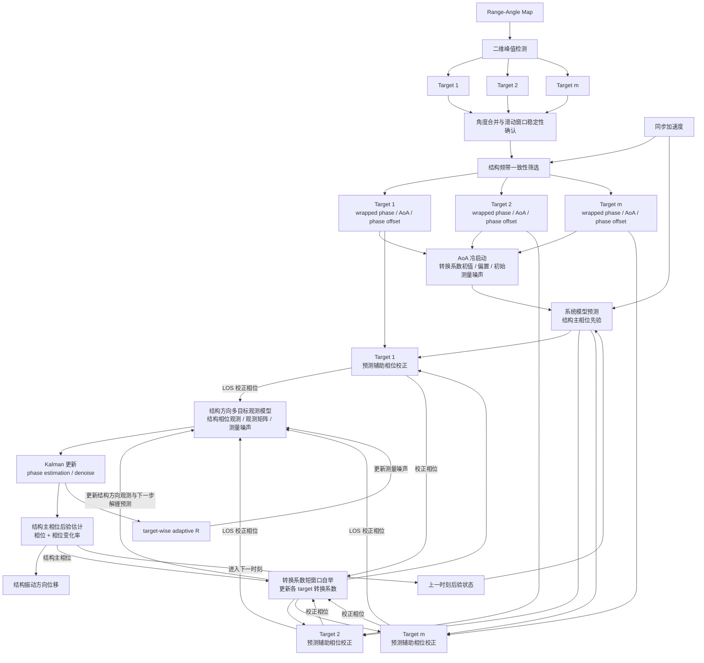

# Kalman 融合流程图预览

> 说明：该文件仅保留为流程图草稿预览，不是当前正式方法文档。当前最新版整体流程以 [overall_processing_architecture.md](/Users/umep/thesis/idea/overall_processing_architecture.md) 为准。

下面是“去公式化节点 + 图下公式”的版本。图中只保留模块关系和变量流向，不在 Mermaid 节点中写下标、上标或长公式；完整数学表达放在图后，由 Obsidian 原生 LaTeX 渲染。

## 图中关键公式

结构主相位状态定义为：

$$
\mathbf{x}_k=
\begin{bmatrix}
\Theta_k\\
\dot{\Theta}_k
\end{bmatrix},
\qquad
\Theta_k=\frac{4\pi}{\lambda}q_k.
$$

系统模型由加速度直接预测结构主相位：

$$
\mathbf{x}_k^-=
\mathbf{A}\mathbf{x}_{k-1}
+
\mathbf{B}\frac{4\pi}{\lambda}a_{k-1}.
$$

其中：

$$
\mathbf{A}=
\begin{bmatrix}
1&T\\
0&1
\end{bmatrix},
\qquad
\mathbf{B}=
\begin{bmatrix}
T^2/2\\
T
\end{bmatrix}.
$$

第 $i$ 个 target 的 LoS 相位预测为：

$$
\hat{\phi}_{i,k}^-
=
\frac{\hat{\Theta}_k^-}{\hat{\beta}_{i,k}}+b_i.
$$

利用预测 LoS 相位对 wrapped phase 进行分支校正：

$$
\phi_{i,k}^{\mathrm{LOS,corr}}
=
\psi_{i,k}
+
2\pi
\operatorname{round}
\left(
\frac{
\hat{\phi}_{i,k}^- - \psi_{i,k}
}{2\pi}
\right).
$$

LoS 校正相位先转换为结构方向主相位观测，再按行堆叠：

$$
\mathbf{y}_k
=
\begin{bmatrix}
y_{1,k}\\
y_{2,k}\\
\vdots\\
y_{m,k}
\end{bmatrix},
\qquad
y_{i,k}=\hat{\beta}_{i,k}\left(\phi_{i,k}^{\mathrm{LOS,corr}}-b_i\right),
\qquad
\mathbf{H}_k
=
\begin{bmatrix}
1&0\\
1&0\\
\vdots&\vdots\\
1&0
\end{bmatrix}.
$$

因此观测模型为：

$$
\mathbf{y}_k
=
\mathbf{H}_k\mathbf{x}_k
+
\mathbf{v}_k.
$$

校正相位同时用于转换系数短窗口自举：

$$
\hat{\beta}_{i}
=
\frac{
\sum_{k\in\mathcal{W}_{\beta}}x_{k,c}y_{k,c}
}{
\sum_{k\in\mathcal{W}_{\beta}}x_{k,c}^{2}
},
\qquad
x_k=\phi_{i,k}^{\mathrm{LOS,corr}}-b_i,
\qquad
y_k=\hat{\Theta}_k^+.
$$

target-wise 测量噪声由后验残差和 target quality gate 自适应更新：

$$
s_{i,k}
=
y_{i,k}-\hat{\Theta}_k^+,
$$

$$
\Delta r_{i,k}
=
\left(
s_{i,k}^2
+
\mathbf{H}_{i}\mathbf{P}_k^+\mathbf{H}_{i}^{\mathrm{T}}
\right)
-
r_{i,k},
\qquad
g_{i,k}
=
\begin{cases}
1-\rho_{i,k}, & \Delta r_{i,k}>0,\\
1, & \Delta r_{i,k}\le 0.
\end{cases}
$$

$$
r_{i,k+1}
=
\operatorname{clip}
\left[
r_{i,k}
+
(1-\alpha)g_{i,k}\Delta r_{i,k},
\ r_{\min},
\ r_{\max}
\right].
$$

最终位移由结构主相位恢复：

$$
\hat{q}_k
=
\frac{\lambda}{4\pi}\hat{\Theta}_k.
$$
