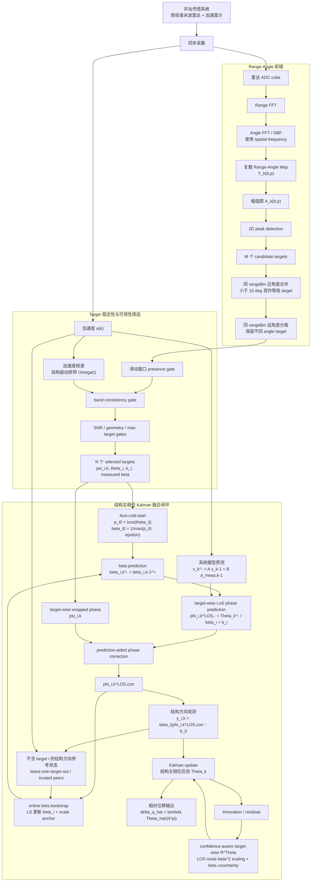
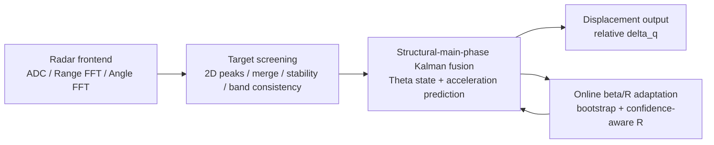

# 毫米波雷达与加速度计结构位移测量 Phase 1 方法与仿真汇报

> 2026-06-21 同步说明：本文档已按当前代码主方法口径刷新。论文主方法使用代码实现名 `proposed_full_pipeline_beta_confidence`，即 calibrated `Q` + SNR-informed initial `R` + confidence-aware target-wise effective `R` + online beta bootstrap；同时新增 `proposed_full_pipeline_aoa_fixed_beta` 作为只关闭 beta 闭环、其余 full-pipeline 机制保持一致的直接对照。`proposed_full_pipeline` 仅作为未标定 `Q` 的 full-pipeline 消融结果保留。

> 本材料面向组会/阶段汇报，目标是说明当前倒挂式毫米波雷达 + 加速度计结构位移估计方案、算法链路、Phase 1 仿真验证设计和当前边界。本文档中的数值来自当前代码重新运行得到的 validation/extended validation；默认主实验 validation gates 为 `7/7` 通过。若后续调整参数，应重新运行 `simulation.phase1.run_validation` 和 `simulation.phase1.run_extended_validation` 后再刷新表格。

## 1. 研究背景与问题定义

本章说明为什么“雷达安装在结构上”会使传统相位位移测量问题发生变化，以及本文 Phase 1 需要验证的核心问题。

桥梁、梁体和轨道结构的动态位移能够直接反映结构刚度、车辆荷载响应和服役状态。激光测振仪、激光位移计、LVDT 等高精度位移测量手段通常需要稳定基准或静态参考系，现场布设受桥下空间、视线遮挡、安装安全和长期维护条件限制。毫米波雷达具备非接触、高相位灵敏度和芯片化部署优势，但当雷达倒挂安装在结构测点并随结构一起振动时，雷达本身不再是静止参考点。

在倒挂式布置中，雷达朝向桥下或周围静止散射体。结构位移使雷达相位中心相对这些静止散射体运动，因此回波相位仍携带结构位移信息，但它不再是“固定雷达测振动目标”的简单场景。直接使用单目标、单 range-bin 相位法会遇到以下问题：

- 同一个 range bin 内可能包含多个角度不同的散射体，复数相量混合后相位不再代表单一物理 target。
- target 选择常依赖经验或最强反射，遇到低 SNR、遮挡、移动干扰或多径时不稳定。
- 原始相位被限制在 `(-pi, pi]`，毫米级位移就可能产生 phase wrapping。
- LoS 相位到结构主振动方向位移之间需要投影/转换系数，角度误差会直接放大位移误差。
- 加速度二次积分可作为动力学约束，但低频漂移、同步误差和标定误差也会影响直接位移参考。

本文 Phase 1 的目标是：利用结构上共址安装的毫米波雷达和加速度传感器，在没有外部静态参考系的条件下，估计结构单点竖向或主振动方向的相对位移。

## 2. 总体方案概述

本章给出方法主线。当前方案不是机械沿用单 range-bin 追踪，而是把参考目标定义提升到 range-angle 维度，并在结构主相位层进行多目标融合。

总体链路为：

```text
ADC 原始数据
-> Range-Angle Map
-> 2D peak detection
-> 同 rangeBin 近角度合并 / 远角度分离
-> 滑动窗口稳定性筛选
-> 频带一致性筛选
-> AoA cold start 得到 beta 初值
-> 多 target 结构主相位 Kalman 融合
-> prediction-aided phase correction
-> confidence-aware target-wise R
-> online beta bootstrap
-> 相对位移输出
```

本文与 Ma-family 方法的核心差异在状态定义。Ma-family baseline 的状态变量是单 target 的 LoS phase：

```text
x_k^Ma = [phi_k, dot_phi_k]^T
```

本文把状态变量改为结构振动方向主相位：

```text
x_k = [Theta_k, dotTheta_k]^T
Theta_k = 4*pi*delta_q_k/lambda
```

这样，加速度可以直接进入结构主相位系统模型；不同 target 的几何差异不再进入状态预测。正文主叙事中，先把第 `i` 个 target 的 LoS corrected phase 转换为结构方向主相位观测：

```text
y_i,k = beta_i * (phi_i,k^LOS,corr - b_i)
y_i,k = Theta_k + e_i,k
H_i = [1, 0]
```

这里 `beta_i` 是 Ma-family direction conversion factor，方向为 `LOS -> 结构真实振动方向`。当前代码与正文统一使用这个定义：prediction-aided phase correction 中用 `Theta_k^- / beta_i + b_i` 回到 LoS 相位空间，Kalman update 前用 `beta_i * (phi_i,k^LOS,corr - b_i)` 构造结构方向观测。

因此，多 target 不再是“多个目标各自估计位移后再平均”，而是在结构主相位状态层进行统一融合。本文的 Ma-family baseline 是“基于公开论文公式与流程实现的 Ma-family baseline”，英文可表述为 “Ma-family baseline based on public formulas/procedures”；它不是 Ma 官方源码复现，也不是 Ma 原始实测数据 replay。

## 3. 完整算法流程图

本章给出两个图：一个用于解释完整数据流，一个用于汇报页快速展示模块关系。图中 LoS corrected phase 同时服务两条路径：先乘 `beta_i` 构造结构方向观测进入 Kalman update；用于 online beta bootstrap 时，则必须与不含该 target 的结构方向参考状态配对，并由加速度参考或可靠几何 target 提供尺度锚定。

### 3.1 完整数据流图



### 3.2 汇报页简化模块图



## 4. 方法细节

本章说明各模块如何接在一起，以及为什么要在 Kalman 前筛选坏 target。

### 4.1 Range-Angle target 提取

仿真前端从 synthetic ADC cube 出发，经 Range FFT 和 Angle FFT/DBF 得到复数 range-angle map `Y_k(b,p)`。这里的 angle 轴按空间频率 `u=sin(theta)` 建立，而不是简单线性铺成 `linspace(-90,90)`。候选 target 通过二维局部峰检测获得，目标单元定义为：

```text
T = (b, C)
```

其中 `b` 是 range bin，`C` 是 angle bin cluster。同一 range bin 内角度差小于约 `15 deg` 的 peaks 合并为等效 target；同一 range bin 但角度差较大的 peaks 保留为不同 target。这是相对于 range-bin-only 方法的重要优势：当两个强散射体处在同一距离单元但 AoA 相差明显时，本文前端可以在 Kalman 前将它们分开，避免把混合相位当作一个稳定 LoS 相位。

### 4.2 Target 稳定性与可用性筛选

Target selection 阶段不做最终相位解缠，只输出复数 slow-time 序列、wrapped phase、AoA 初值和可用 mask。筛选包括：

- `presence gate`：候选 target 需要在滑动窗口内稳定出现。
- `band consistency gate`：target IQ 的 slow-time 变化要集中在加速度识别出的结构振动频带。
- `SNR gate`：低质量 target 不优先进入融合。
- `geometry gate`：过小投影系数或不可靠角度不会被过度信任。
- `max selected targets`：限制进入 Kalman 的 target 数量，保持观测集合稳定。

这些筛选在 Kalman 前完成，是为了避免坏 target 先进入状态更新再由滤波器“事后补救”。对进入 Kalman 的 target，后续还会由 confidence-aware target-wise `R` 动态调低不可靠观测权重。

### 4.3 结构主相位 Kalman 模型

状态定义为：

```text
x_k = [Theta_k, dotTheta_k]^T
Theta_k = 4*pi*delta_q_k/lambda
```

系统模型由加速度驱动：

```text
x_k^- = A x_{k-1}^+ + B a_meas,k-1
```

结构方向观测模型为：

```text
y_i,k = beta_i * (phi_i,k^LOS,corr - b_i)
y_i,k = Theta_k + e_i,k
H_i = [1, 0]
```

当前主方法采用 calibrated `Q`，即在候选过程噪声强度中用无真值 prediction innovation energy 选出 `q^\star`，在线阶段固定使用 `Q=q^\star Q_0`。每个 target 的基础 `R_i,k` 由 SNR-informed 初值、posterior residual 和状态不确定性递推；若观测写在结构方向，有效观测噪声需包含 LoS 相位噪声被 `beta_i^2` 放大，以及 `beta_i` 自身不确定性的传播：

```text
R_i,k^Theta ~= beta_i^2 * R_i,k^LOS
              + (phi_i,k^LOS,corr - b_i)^2 * sigma_beta_i,k^2
```

这个 confidence-aware 项只用于支撑 AoA cold start 和 online beta bootstrap：当转换系数尚未收敛时降低对应 target 的观测权重，bootstrap 收敛后该项自然回落。它不是本文单独包装的创新点。

原始相位是 wrapped phase：

```text
psi_i,k = angle(z_i(k)), psi_i,k in (-pi, pi]
```

Kalman 预测主相位后，先映射到 target LoS phase：

```text
phi_i,k^LOS,- = Theta_k^- / beta_i + b_i
```

再执行 prediction-aided phase correction：

```text
phi_i,k^LOS,corr = psi_i,k + 2*pi*round((phi_i,k^LOS,- - psi_i,k)/(2*pi))
```

同一个 `phi_i,k^LOS,corr` 先乘 `beta_i` 构造结构方向观测进入 Kalman update，同时也作为 beta bootstrap 的 LoS 侧输入。本文不将同一 target 参与生成的后验结构相位直接作为该 target 的 beta 收敛证据。为避免自反馈，`beta_i` 的在线更新使用第 `i` 个 target 的 LoS corrected phase 与不含该 target 的结构方向参考状态进行最小二乘拟合；同时引入加速度参考或可靠几何 target 作为尺度锚定，以抑制多 target 共同尺度漂移。

### 4.4 与 Ma-family baseline 的对比

Ma-family baseline 的优势在于把加速度预测、相位分支校正和 Kalman 降噪统一在状态空间框架中。本文保留这一思想，但改变状态物理含义和观测组织方式：

| 对比项 | Ma-family baseline | 本文方法 |
|---|---|---|
| 状态相位 | 单 target LoS phase | 结构主相位 `Theta` |
| 加速度进入方式 | 需经转换系数映射到 LoS phase | 直接预测结构主相位 |
| 目标组织 | 单 target 或 range-bin 级候选 | range-angle target / angle cluster |
| 同 range 远角度目标 | 容易相干混合为一个 pseudo target | 在前端分离为不同 target |
| 转换系数 | 常依赖离线 beta 标定或 range-bin 拟合 | AoA cold start + online beta bootstrap |
| 观测噪声 | 公开流程中以固定设置为主 | confidence-aware target-wise `R_eff` |

需要强调：本文默认主对比中的 `ma2026_reproduction` 是根据 Ma 2026 公开论文公式与流程实现的 paper-equation baseline，不是 Ma 官方源码复现；`ma_style_iterative_beta_range_bin` 是机制消融 baseline，不应写成 Ma 官方完整方法。

## 5. 仿真实验设计

本章说明数据从哪里来、仿真怎样构造、评价对象是什么。Phase 1 主要验证算法闭环可行性，不声称完成真实桥梁毫米波雷达实测。

### 5.1 仿真总体逻辑

仿真逻辑为：

```text
不同 scenario 生成 q_true(t)
-> 雷达物理相位模型生成 IQ / wrapped phase / synthetic ADC cube
-> 加速度观测生成 a_meas(t)
-> 各方法统一处理同一组观测
-> 与相对位移真值 delta_q(t) 比较
```

评价目标是相对位移：

```text
delta_q(t) = q(t) - mean(q over cold_start_window)
```

因此，Phase 1 关注动态相对位移恢复，不讨论绝对静态零位。

### 5.2 雷达观测仿真

每个 target 的结构主相位和 LoS 相位关系优先写为：

```text
Theta(t) = 4*pi*q(t)/lambda
Theta(t) = beta_i * phi_i^LOS(t)
phi_i^LOS(t) = Theta(t)/beta_i + b_i
IQ_i(t) = A_i exp(j phi_i^LOS(t)) + complex_noise
wrapped_phase_i(t) = angle(IQ_i(t))
```

当前代码与正文统一采用上述物理相位模型，`beta_i` 始终表示 LoS 到结构真实振动方向的转换系数。

full pipeline 进一步生成 synthetic ADC cube，并通过 Range FFT、Angle FFT/DBF 和 Range-Angle Map 前端提取候选 target。这样可以检查“ADC -> range-angle -> target selection -> Kalman”完整链路，而不是只在理想 target phase 上做后端滤波。

### 5.3 加速度观测仿真

普通合成场景使用真值位移求得 `a_true(t)`，再叠加噪声、偏置、漂移和同步误差，得到 `a_meas(t)`。

实桥半实测场景使用 TDMS 激光位移 `卡3激光位移/3-4` 作为真实桥梁波形来源：

```text
TDMS 激光位移 3-4
-> 事件窗口截取
-> 重采样到 100 Hz radar slow-time
-> 单位换算与 cold-start 相对零位
-> q_true(t)
-> 对另一份 0.2-30 Hz 滤波副本做二阶微分
-> 加 seeded accelerometer noise 得到 a_meas(t)
```

该场景是“实测位移驱动的半实测仿真”；激光位移 truth 默认不做带通或工频陷波，雷达观测仍由物理相位模型合成；原始 TDMS 加速度通道当前仅作为诊断与后续标定方向，不作为主验证输入。这不是完整实测毫米波雷达验证。

### 5.4 场景设计表

默认主实验只保留 5 个场景。它们分别对应本文核心创新链条：文献主频桥梁响应、强相位缠绕、同 range-bin 远角度分离、AoA cold start 与 beta bootstrap，以及 target 质量退化下的自适应权重。其余场景保留为附录、敏感性或诊断实验，不进入默认主结果表。

**主实验场景**

| scenario | 真实位移来源/波形 | target 数 | target angles | target SNR | 特殊退化条件 | 设计目的 |
|---|---|---:|---|---|---|---|
| `literature_maglev_modal_response` | 文献主频 7.7737/11.5742/26.5642 Hz，车辆事件包络，峰值约 1.8 mm | 5 | 8/18/28/38/50 deg | 26/24/22/20/18 dB | 200 Hz slow-time；quiet start；频谱主峰展宽和泄漏 | 替代脏 TDMS 的正式文献主频驱动桥梁响应仿真 |
| `strong_wrapping` | 2/5/12 Hz，强 wrapping profile，峰值约 5.0 mm | 5 | 10/25/40/55/70 deg | 30/25/20/15/10 dB | quiet -> 微振 -> ramp -> strong wrapping -> decay | 压测 prediction-aided phase correction |
| `same_range_far_angles` | 2/5/12 Hz，普通峰值约 1.5 mm | 4 | 0/45/25/65 deg | 36/36/32/32 dB | 4 个 target 均在 range bin 12，角度相差明显 | 验证 range-angle frontend 分离同 range 远角度目标 |
| `aoa_error_bootstrap` | 默认多频峰值约 1.5 mm | 5 | 10/25/40/55/70 deg | 25/20/15/10/5 dB | AoA 初值误差 10 deg | 验证 AoA 初值误差下的 beta error reduction；收敛判断必须查看 target-wise beta error、last-window median error 和更新 gate |
| `target_snr_drop` | 默认多频峰值约 1.5 mm | 5 | 10/25/40/55/70 deg | 25/20/15/10/5 dB | target 0/1 在 1.6-3.4 s 降 25 dB | 验证 confidence-aware target-wise R |
| `vehicle_event_nonstationary` | 非平稳车辆事件包络，quiet start 0.10 s | 5 | 10/25/40/55/70 deg | 25/20/15/10/5 dB | center 2.2 s，width 0.35 s | 仅保留为诊断/附录场景，不进入默认主实验 |

**附录 / 诊断 / 敏感性场景**

| scenario | 定位 | 保留原因 | 默认主表 |
|---|---|---|---|
| `nominal_multifrequency` | sanity check | 用于检查普通多频合成链路是否正常，不承担创新点证明 | 否 |
| `target_dropout` | 鲁棒性附录 | 检查目标短时缺失时 available mask 和多目标冗余是否工作 | 否 |
| `mixed_scatterer_rangebin` | 鲁棒性附录 | 检查同 bin 复合散射造成的相位畸变 | 否 |
| `low_snr_multitarget` | SNR 敏感性 | 作为低 SNR 下界压力测试，主要进入 extended validation | 否 |

`measured_bridge_point4_transverse` 是额外可选的半实测诊断场景：它使用 TDMS 激光位移 `3-4` 的 15.33-19.33 s 事件窗作为位移 truth，target angles 为 5/15/25/35/45 deg，target SNR 为 26/24/22/20/18 dB。由于原始 TDMS 通道污染和传感器一致性问题尚未完全解决，它不进入默认主表，也不作为正式精度结论。

### 5.5 关键中间结果图

以下图均为 Markdown 绝对路径引用。图像已改用报告专用 PNG 版本，避免 SVG 在深色模式或部分 Markdown 环境中出现空白、白块或坐标轴缺失。


图 1 展示车辆非平稳事件诊断场景中某帧二维 Range-Angle Map 的幅值热力图，并标注 full pipeline 选中的候选 target，用于说明 full pipeline 从 synthetic ADC / Range-Angle Map 中提取候选目标，而不是直接使用理想 target 相位。该场景不进入当前默认主结果表。


图 2 展示车辆事件中候选 target 的在线选择状态。fresh summary 显示该场景 full pipeline 选中 4 个 target，并排除了不可靠 target。


图 3 对比 all-target proposed 与 full pipeline 目标筛选后的位移结果。该图用于说明 target screening 不是装饰步骤，而是能降低坏 target 对状态的影响。


图 4 展示 strong wrapping 场景中 wrapped phase、prediction-aided corrected phase 与真实 LoS phase 的关系，说明预测辅助分支选择如何在相位绕转时维持局部连续观测。


图 5 展示目标质量退化时 confidence-aware target-wise `R` 的变化。低质量 target 的基础观测噪声会随 innovation 增大；结构方向表述中 `beta` 不确定性会传播到 `R_i^Theta`，从而在 Kalman update 中降低不可靠 target 的权重。


图 6 展示 AoA 初值误差场景下 `beta` 在线估计与真实参考值的关系。fresh gate 中 `aoa_bootstrap_beta_median_relative_error_le_0p05` 通过，说明 `beta` bootstrap 在该受控场景中降低了转换系数误差；该结论来自 target-wise beta error、last-window median error 和更新 gate 诊断，而不是由 displacement RMSE 单独推出。


图 7 展示 TDMS 激光位移多通道时域响应，本文半实测场景选用 `卡3激光位移/3-4` 的事件窗口作为位移波形来源。


图 8 展示激光通道频谱特性，用于支撑分析频带和工频陷波设置。


图 9 展示激光通道动态成分相关性，说明所选桥梁响应波形具有通道一致性基础。

## 6. 实验结果与分析

本章使用 fresh validation 的 `metrics.csv`。默认正式验证现在包含 `literature_maglev_modal_response`，不再默认包含本地 TDMS 驱动的 `measured_bridge_point4_transverse`；后者仅作为可选诊断场景保留。

需要注意，`ma2026_reproduction` 只使用 Range FFT range-bin candidate 作为仿真 adapter，不使用本文的 Range-Angle frontend 或 angle-bin target selection。`ma2026_target` 对应 Ma 2026 的 target-specific LoS phase Kalman、`Q=10^j` energy selection 和 alpha/beta 线性拟合；`ma2026_reproduction` 外层仅增加 Range FFT range-bin candidate adapter，将距离谱第一个候选送入单 target 方法。对于合成仿真，alpha 拟合直接使用可获得的 true continuous LoS phase 作为 corrected/unwrapped radar phase 输入；若 range-bin candidate 无法唯一对应到一个仿真 target，则退化为普通 wrapped-phase unwrapping 作为输入 adapter，不引入 beta-grid target selection。其中 Ma 2026 的 `Q` 选择已按原文 Eq. (16) 使用 corrected/unwrapped measurement phase `z_corr` 的能量，而不是 Kalman posterior phase 的能量；alpha 拟合默认实验频带为 `[0.5 Hz, 3 Hz]`，对本文高主频合成场景仅按原文规则提高上限以覆盖配置的结构主频。

### 6.1 方法对比表

| 方法 | 输入/假设 | 主要用途 | 解释边界 |
|---|---|---|---|
| `range_bin_itoh` | ADC 经 range FFT 后按 range profile 选最强 range bin，在该 bin 内取最强 virtual-RX slow-time IQ，Itoh unwrap，再用 measured/equivalent beta 换算 | 默认主表：传统毫米波 range-bin 相位 baseline | 不使用理想 target phase；对同 range 多角度混合、强 wrapping、AoA/等效 beta 误差敏感 |
| `ma2026_reproduction` | Range-bin adapter 取距离谱第一个候选 + Ma2026 target-specific LoS Kalman + `Q` energy selection + alpha/beta 线性拟合 | 默认主表：Ma 2026 paper-equation baseline | target-specific Kalman 按原文实现；合成仿真中 alpha fit 使用 true continuous LoS phase 作为 corrected/unwrapped phase 输入；不使用 beta-grid target selection 或 angle-bin 选择 |
| `selected_aoa_fixed_beta` | 前端筛选 target + AoA fixed beta | 默认主表：检查只筛选、不 bootstrap 的效果 | AoA 误差不能在线修正 |
| `proposed_full_pipeline_aoa_fixed_beta` | ADC/Range-Angle 前端 + target selection + calibrated `Q` + confidence-aware `R_eff` + AoA fixed beta | 默认主表：隔离“只关闭 beta 闭环”的 full-pipeline 对照 | 与 beta-bootstrap 方法共用 Q/R/前端，只保持 beta 等于 AoA 初值 |
| `proposed_full_pipeline_beta_confidence` | ADC/Range-Angle 前端 + target selection + calibrated `Q` + confidence-aware `R_eff` + online beta bootstrap | 默认主表：Phase 1 主方法 | 当前仍是合成/半实测仿真链路 |
| `itoh_ls` | 理想 target-level 单目标相位 + Itoh unwrap | 诊断参考 | 绕过 range-bin/front-end，不再作为传统毫米波基本 baseline |
| `range_bin_only_mixed_phase` | 使用同一个 range-FFT range-bin slow-time IQ 作为单 pseudo-target，再进入 Kalman 后端 | 扩展/诊断消融：证明 range-bin-only 观测即使进入 Kalman，也无法替代 angle-bin target 分离 | 机制 baseline，不代表完整 Ma 方法，不进入默认主表 |
| `single_target_ma_style` | 单 target acceleration-aided Kalman | 废弃兼容方法 | 已由 `ma2026_reproduction` 替代，不进入默认主表 |
| `proposed` | 所有 target + target-wise R + online beta bootstrap；代码侧更新 beta | 诊断方法 | 不包含完整前端筛选、calibrated Q 和前端 target selection，不进入默认主表 |
| `proposed_full_pipeline` | ADC/Range-Angle 前端 + target selection + proposed Kalman | 废弃 full-pipeline 消融 | 旧 R 版本，不进入默认主表 |

### 6.2 总体 RMSE 对比表

单位为 mm。数值越小表示相对位移估计误差越低。

| 场景 | `range_bin_itoh` | `ma2026_reproduction` | `selected_aoa_fixed_beta` | `proposed_full_pipeline_aoa_fixed_beta` | `proposed_full_pipeline_beta_confidence` |
|---|---:|---:|---:|---:|---:|
| `literature_maglev_modal_response` | 0.026555 | 0.376034 | 0.067747 | 0.025269 | 0.018748 |
| `strong_wrapping` | 7.763019 | 0.083064 | 29.826083 | 0.078898 | 0.037236 |
| `same_range_far_angles` | 0.180771 | 0.295380 | 0.058812 | 0.074754 | 0.039996 |
| `aoa_error_bootstrap` | 0.232154 | 0.782403 | 0.057941 | 0.041867 | 0.026086 |
| `target_snr_drop` | 0.087776 | 0.270958 | 0.078685 | 0.067377 | 0.062566 |

### 6.3 关键场景 RMSE 表

| 场景 | 主要验证点 | `ma2026_reproduction` | `selected_aoa_fixed_beta` | `proposed_full_pipeline_aoa_fixed_beta` | `proposed_full_pipeline_beta_confidence` | selected count | unwrap rate | 结论 |
|---|---|---:|---:|---:|---:|---:|---:|---|
| `literature_maglev_modal_response` | 文献主频驱动桥梁响应 | 0.376034 | 0.067747 | 0.025269 | 0.018748 | 5 | 0.000000 | 按 Ma2026 Eq. (16) 的 `z_corr` energy 选 Q 后，该 baseline 在当前合成响应中偏向较小 Q；固定 AoA full-pipeline 已显著改善，beta-bootstrap 进一步降低 RMSE |
| `strong_wrapping` | prediction-aided phase correction | 0.083064 | 29.826083 | 0.078898 | 0.037236 | 4 | 0.000000 | 完整 Q/R 机制先消除固定 AoA 基础 baseline 的解缠失败；beta-bootstrap 继续降低 RMSE |
| `same_range_far_angles` | 同 range bin 远角度分离 | 0.295380 | 0.058812 | 0.074754 | 0.039996 | 2 | 0.000000 | 严格 Ma range-bin baseline 不使用 angle-bin 选择；beta-bootstrap 在该场景低于固定 AoA full-pipeline |
| `target_snr_drop` | confidence-aware target-wise R | 0.270958 | 0.078685 | 0.067377 | 0.062566 | 4 | 0.000500 | 退化 target 被动态降权，主状态不被坏观测长期污染；beta-bootstrap 增益较小但仍降低 RMSE |
| `aoa_error_bootstrap` | online beta bootstrap；代码侧 beta 诊断 | 0.782403 | 0.057941 | 0.041867 | 0.026086 | 4 | 0.000000 | AoA 初值只作为启动先验；固定 AoA full-pipeline 是关闭 beta 闭环的直接对照，beta 误差是否降低仍需独立诊断 gate 判断 |

### 6.4 关键场景分析

**strong_wrapping。** 该场景将真实位移峰值提高到约 5 mm，使 wrapped phase 多次跨越 `+-pi`。`selected_aoa_fixed_beta` 在固定 Q/R 较弱配置下发生大量解缠错误；`proposed_full_pipeline_aoa_fixed_beta` 仅通过完整 calibrated Q 和 confidence-aware R 就将 RMSE 降至 0.078898 mm，`proposed_full_pipeline_beta_confidence` 进一步降至 0.037236 mm，说明 beta 闭环应和完整 Q/R 链路分开解释。

**same_range_far_angles。** 该场景中 4 个主要 target 均位于同一 range bin，但 AoA 差异明显。严格 `ma2026_reproduction` 只使用 Range FFT range-bin 相位，不使用本文的 Range-Angle frontend；其 RMSE 为 0.295380 mm。本文 Range-Angle frontend 在 Kalman 前保留不同 angle target，`proposed_full_pipeline_aoa_fixed_beta` RMSE 为 0.074754 mm，`proposed_full_pipeline_beta_confidence` RMSE 为 0.039996 mm。这里不能再把任何 angle-bin 选择能力算到 Ma baseline 上。

**target_snr_drop。** target 0/1 在 1.6-3.4 s SNR 降低 15 dB。传统 `range_bin_itoh` 为 0.087776 mm，`ma2026_reproduction` 为 0.270958 mm，`selected_aoa_fixed_beta` 为 0.078685 mm，`proposed_full_pipeline_aoa_fixed_beta` 为 0.067377 mm，`proposed_full_pipeline_beta_confidence` 为 0.062566 mm。confidence-aware `R_eff` 使退化 target 和转换系数尚不稳定的 target 获得较低观测权重，降低坏观测对结构主相位状态的污染。

**aoa_error_bootstrap。** AoA 初值来自 FFT angle-bin 前端量化/分辨率误差，用于检验转换系数自举。严格 `ma2026_reproduction` 为 0.782403 mm，`selected_aoa_fixed_beta` 固定几何初值，RMSE 为 0.057941 mm；`proposed_full_pipeline_aoa_fixed_beta` 为 0.041867 mm；`proposed_full_pipeline_beta_confidence` 为 0.026086 mm。该结果说明 AoA 更适合作为 cold start，而不是作为最终固定转换系数；beta 是否收敛必须由 target-wise beta error、last-window median error 和更新 gate 判断，不能由位移 RMSE 单独替代。

**literature_maglev_modal_response。** 该场景不再直接使用 TDMS 位移通道，而是采用目标桥梁相关文献给出的竖向主频 `7.7737/11.5742/26.5642 Hz`，叠加 quiet-start 车辆事件包络并归一化到约 1.8 mm 峰值位移。由于有限窗和非平稳包络，频谱表现为主频附近凸起和泄漏，而不是理想单频线谱。按原文 Eq. (16) 选择 `Q` 后，`ma2026_reproduction` RMSE 为 0.376034 mm；`proposed_full_pipeline_aoa_fixed_beta` RMSE 为 0.025269 mm；`proposed_full_pipeline_beta_confidence` RMSE 为 0.018748 mm，unwrap error rate 为 0。该场景是当前正式桥梁响应仿真的主场景；本地 TDMS 半实测场景只保留为可选诊断，不作为精度结论。

### 6.5 Extended validation 摘要

fresh extended validation 使用 seeds 2026-2030，覆盖 Monte Carlo、消融、AoA sensitivity 和 SNR sensitivity。摘要显示：

- `same_range_far_angles` 的 Monte Carlo 中，`proposed_full_pipeline_beta_confidence` 平均 RMSE 为 0.016271 mm，低于 `range_bin_only_mixed_phase` 的 0.269230 mm 和 `ma2026_reproduction` 的 0.121716 mm。
- `target_snr_drop` 的 Monte Carlo 中，`proposed_full_pipeline_beta_confidence` 平均 RMSE 为 0.056421 mm，低于 `selected_aoa_fixed_beta` 的 0.086099 mm。
- AoA sensitivity 中，AoA 误差从 0 到 15 deg 时，`proposed_full_pipeline_beta_confidence` 维持在很低 RMSE 水平；这反映当前前端选择、confidence-aware R 和 online beta bootstrap 对 AoA 初值误差的位移影响具有一定缓冲。若要声称 beta 收敛，仍需独立检查 target-wise beta error、last-window median error 和更新 gate。
- SNR sensitivity 中，随着 SNR floor 从 4 dB 提升到 12 dB，`proposed_full_pipeline_beta_confidence` RMSE 从 0.062440 mm 降到 0.029349 mm。

这些结果支持 Phase 1 算法级可行性，但不替代真实 ADC 和现场同步验证。

## 7. 方案比选

本章把旧稿中的方案讨论整理为当前方案比选表。最终采用的是 `Range-Angle frontend + target selection + structural-main-phase Kalman + calibrated Q + confidence-aware R + online beta bootstrap`。

| 方案 | 优点 | 局限 | 是否采用 | 原因 |
|---|---|---|---|---|
| 传统 range-bin phase + Itoh unwrap + beta 换算 | 符合毫米波雷达最基本相位测量流程：range FFT/Range-Angle 前端后选 range bin，再取复数 slow-time 相位 | 同 range-bin 多角度散射体会被相干混合；强 wrapping 和等效 beta 偏差会放大误差；不利用加速度预测和多目标冗余 | 不作为主方案 | 用作基本 baseline，说明仅靠 range-bin 相位法不足以覆盖退化场景 |
| Ma-style 单 target / range-bin beta 标定 + Kalman | 文献基线清晰；加速度辅助 Kalman 能统一相位预测、解缠和降噪 | 状态是单 target LoS phase；多 target 和同 range 多角度散射体不易自然融合；beta 标定对混合相位和加速度参考敏感 | 作为对比 baseline | 保留 Ma-family 思想对比，但不作为最终框架 |
| 多 target fixed beta Kalman | 已具备结构主相位 + 多通道观测骨架；可利用多 target 冗余 | 假设 beta 已知且稳定；无法修正 AoA 和安装误差；坏 target 会长期污染观测 | 部分采用为结构骨架 | 多目标观测模型被采用，但 fixed conversion 不作为最终设置 |
| 多 target AoA fixed beta Kalman | AoA 元数据能提供 cold start，避免先完整解缠再标定 beta 的死锁 | AoA 只是几何先验；真实阵列误差、旁瓣和安装姿态会影响 beta；固定后不能收敛修正 | 作为初始化和 baseline | 本文保留 AoA cold start，但后续必须 online bootstrap |
| 本文 beta-bootstrap / confidence-aware proposed full pipeline | 完整覆盖 ADC/Range-Angle 前端、目标筛选、结构主相位 Kalman 融合、prediction-aided phase correction、calibrated Q、confidence-aware R 和 online beta bootstrap | 当前仍是 Phase 1 合成仿真与实测位移驱动的半实测仿真；真实 ADC、天线标定、同步和现场多径未完成 | 采用为主方案 | 与当前论文创新主线一致，并能解释同 range 远角度、target 退化和 AoA 初值误差等关键失败模式 |

## 8. 当前结论与后续工作

本章明确当前已经完成什么、还缺什么。结论保持客观，不把 Phase 1 结果扩展为部署级实测结论。

### 8.1 当前结论

- 已完成 Phase 1 算法级合成仿真与实测位移驱动的半实测仿真。
- 当前方法链路完整覆盖 frontend target extraction、selection、结构主相位 Kalman 融合、prediction-aided phase correction、calibrated Q、confidence-aware target-wise R、online beta bootstrap 和相对位移输出。
- fresh validation 的 7 个默认主实验 feasibility gates 全部通过。
- 仿真表明，在文献主频桥梁响应、strong wrapping、same-range far-angle、target SNR drop 和 AoA 初值误差等主实验场景中，full pipeline 具有稳定表现。
- 实桥半实测场景表明，真实桥梁位移波形下完整链路可运行；但这不是完整实测毫米波雷达验证。

### 8.2 当前完成/未完成工作表

| 类别 | 当前状态 | 说明 |
|---|---|---|
| synthetic ADC / Range-Angle frontend | 已完成 | synthetic ADC cube、Range FFT、Angle FFT/DBF、Range-Angle Map 已接入 |
| 2D peak detection 与 target extraction | 已完成 | 包括二维局部峰、阈值筛选、同 rangeBin 近角度合并 |
| same rangeBin far-angle separation | 已完成 | 同 range 远角度 target 在 Kalman 前分离 |
| 滑动窗口稳定性与频带一致性筛选 | 已完成 | 使用 presence 和加速度频谱先验筛选可用 target |
| Ma 2026 baseline | 已完成 Phase 1 合成复现 | `ma2026_target` 原文 Kalman 链路已按 Section 3.1-3.3 对齐；仍不是 Ma 官方源码级 replay |
| 结构主相位多 target Kalman | 已完成 | 论文正文与代码统一写为结构方向观测 `H_i=[1,0]` |
| prediction-aided phase correction | 已完成 | 用结构主相位预测辅助 wrapped phase 分支选择 |
| confidence-aware target-wise R | 已完成 | 退化 target 动态降权；结构方向表述传播 beta 不确定性 |
| online beta bootstrap | 已完成 | `phi_i,k^LOS,corr` 用于结构方向 Kalman update；更新 `beta_i` 时改用不含 target `i` 的结构方向参考状态，并依赖加速度参考或可靠几何 target 做尺度锚定 |
| 实桥半实测场景 | 已完成 Phase 1 验证 | 使用 TDMS 激光位移驱动，雷达观测仍由物理相位模型合成 |
| 真实 IWR1843 ADC 文件解析 | 未完成 | 需要接入真实 raw ADC 文件格式、帧结构和通道组织 |
| 真实天线幅相标定 | 未完成 | 包括 RX/TX 通道幅相、阵列误差和角度轴校准 |
| 真实 TDM-MIMO 相位补偿 | 未完成 | 多 TX 时序导致的相位补偿尚未进入实测链路 |
| 雷达/激光/加速度时间同步 | 未完成 | 需要真实采集链路时间戳对齐和同步误差建模 |
| 真实加速度传感器标定 | 未完成 | 包括灵敏度、方向、bias、重力分量和测点对应关系 |
| 现场安装姿态 / geometry adapter 标定 | 未完成 | AoA 到结构主振动方向投影关系需现场标定 |
| 实桥 mmWave + laser + accelerometer 同步实测验证 | 未完成 | 需要真实雷达 ADC 与参考传感器同步采集后的端到端验证 |
| 多径和真实环境鲁棒性 | 未完成 | 包括桥下多径、旁瓣、相干散射体、移动干扰和长期稳定性 |

### 8.3 后续工作

后续应优先推进：

1. 真实 IWR1843 ADC 文件解析，明确 chirp/frame/channel 组织和数据校准流程。
2. 真实天线幅相标定与 TDM-MIMO 相位补偿，建立可信 AoA 轴。
3. 雷达、加速度、激光或位移参考的时间同步方案。
4. 加速度传感器灵敏度、安装方向和测点对应关系标定。
5. 实桥毫米波雷达 + 激光/加速度同步实测验证。
6. 真实桥下多径、遮挡、移动散射体和长期 target 失效/切换鲁棒性验证。

## 9. 本次报告使用的资料与结果文件

关键资料：

- `/Users/umep/thesis/thesis_idea_overview.md`
- `/Users/umep/thesis/idea/overall_processing_architecture.md`
- `/Users/umep/thesis/innovation_points/multi_target_phase_kalman_fusion.md`
- `/Users/umep/thesis/innovation_points/online_multi_target_selection.md`
- `/Users/umep/thesis/innovation_points/equivalent_conversion_factor_stability.md`
- `/Users/umep/thesis/docs/algorithm_chain_review.md`
- `/Users/umep/thesis/simulation/phase1/README.md`
- `/Users/umep/thesis/simulation/phase1/config.py`
- `/Users/umep/thesis/simulation/phase1/scenarios/`
- `/Users/umep/thesis/simulation/phase1/measured_bridge.py`
- `/Users/umep/thesis/simulation/phase1/algorithm.py`
- `/Users/umep/thesis/simulation/phase1/ma2026/`
- `/Users/umep/thesis/datafile/analysis/`

fresh validation 结果：

- `/Users/umep/thesis/simulation/outputs/phase1_report_validation/metrics.csv`
- `/Users/umep/thesis/simulation/outputs/phase1_report_validation/summary.md`
- `/Users/umep/thesis/simulation/outputs/phase1_report_validation/feasibility_gates.json`
- `/Users/umep/thesis/simulation/outputs/phase1_report_extended_validation/extended_summary.md`
- `/Users/umep/thesis/simulation/outputs/phase1_report_extended_validation/monte_carlo_summary.csv`
- `/Users/umep/thesis/simulation/outputs/phase1_report_extended_validation/ablation_summary.csv`
- `/Users/umep/thesis/simulation/outputs/phase1_report_extended_validation/sensitivity_aoa.csv`
- `/Users/umep/thesis/simulation/outputs/phase1_report_extended_validation/sensitivity_snr.csv`

本报告的边界：当前结论来自 Phase 1 合成仿真和实测位移驱动的半实测仿真；不把当前结果写成部署级系统结论，不把半实测结果写成实桥毫米波雷达现场验证，不声称复现 Ma 官方源码。
